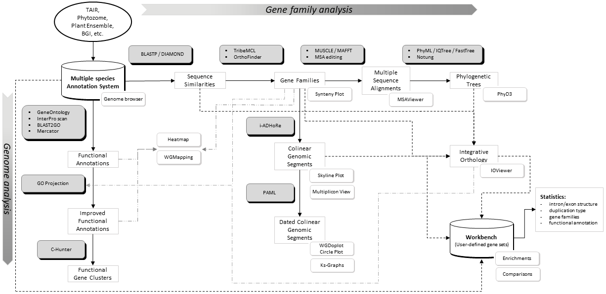

```{r setup, include=FALSE}
knitr::opts_chunk$set(dev = c('png', 'pdf'),  # this embeds pdf and crates scrolable blocks if pdf is first
                      fig.path = "../reports/PLAZA/", # save each figure here
                      # dev = c('png'), 
                      fig.align = 'center', 
                      dpi = 300,
                      fig.height = 8, 
                      fig.width = 9 ,
                      warning = FALSE, message = FALSE
                      )
```


```{r,  echo=TRUE, warning=FALSE, message=FALSE}

rm(list = ls(all = TRUE))
gc()


library(magrittr)
library(ggplot2)

setwd(dirname(rstudioapi::getActiveDocumentContext()$path))


```


Michiel Van Bel, Francesca Silvestri, Eric M Weitz, Lukasz Kreft, Alexander Botzki, Frederik Coppens, Klaas Vandepoele, PLAZA 5.0: extending the scope and power of comparative and functional genomics in plants, Nucleic Acids Research, Volume 50, Issue D1, 7 January 2022, Pages D1468–D1474, https://doi.org/10.1093/nar/gkab1024



<https://bioinformatics.psb.ugent.be/plaza/documentation/construction>

<https://bioinformatics.psb.ugent.be/plaza/versions/plaza_v5_dicots/download/download>

* Tree-based ortholog
* integrative_orthology.TROG.csv.gz  
* inferred using tree reconciliation of the phylogenetic tree of a gene family

<https://bioinformatics.psb.ugent.be/plaza/documentation/data_content>

<https://bioinformatics.psb.ugent.be/plaza/documentation/construction_settings>

* Phylogeny construction settings
  - FastTree
    - default settings
  - MAFFT
    - Default settings
  - Notung
    - Default settings


# plant selection

```{r}

fp = file.path('..', 'input', 'PLAZA')

species = c('ath', 
            'mdo',
            'ppe', 
            'sly', 
            'stu',
            'vvi')

```


```{r}

clean_text = function(x) {
  if (is.character(x)) {
    # Remove all whitespace and quotes
    cleaned <- gsub("[\\s\"']", "", x, perl = TRUE)
    # Replace "NULL" with NA
    ifelse(cleaned == "NULL", NA, cleaned)
  } else {
    x
  }
}

```

# trog

```{r}

fn = 'integrative_orthology.TROG.csv.gz'

dt = data.table::fread(file.path(fp, fn) , skip = 2)
gc()
colnames(dt) = sub('\\#', '', colnames(dt))
df = dt[dt$query_species %in% species & dt$orthologous_species %in% species, ]
rm(dt)
gc()
df = as.data.frame(lapply(df, clean_text), stringsAsFactors = FALSE)
table(df$query_species, df$orthologous_species)

df = df[df$query_species != df$orthologous_species, ]
table(df$query_species, df$orthologous_species)

ind1 = grep("ath", df$query_species, ignore.case = TRUE)
ind2 = grep("ath", df$orthologous_species, ignore.case = TRUE)

df_sub1 = df[ind1, ]
df_sub2 = df[ind2, ]
columns = c("orthologous_gene", "orthologous_species", "query_gene", "query_species")
df_sub2 = df_sub2[, columns]
colnames(df_sub2) = colnames(df_sub1)
dt = rbind(df_sub1, df_sub2)

table(dt$query_species, dt$orthologous_species)
dt = dt[!duplicated(dt), ]
table(dt$query_species, dt$orthologous_species)

dt$source = 'PLAZA'

data.table::fwrite(dt, '../intermediate/PLAZA_selection.txt', sep = '\t')
zip(zipfile = "../intermediate/PLAZA_selection.txt.zip", files = "../intermediate/PLAZA_selection.txt")
file.remove("../intermediate/PLAZA_selection.txt")


```


# sessionInfo

```{r,  echo=TRUE, warning=FALSE, message=FALSE}

sessionInfo()

```


