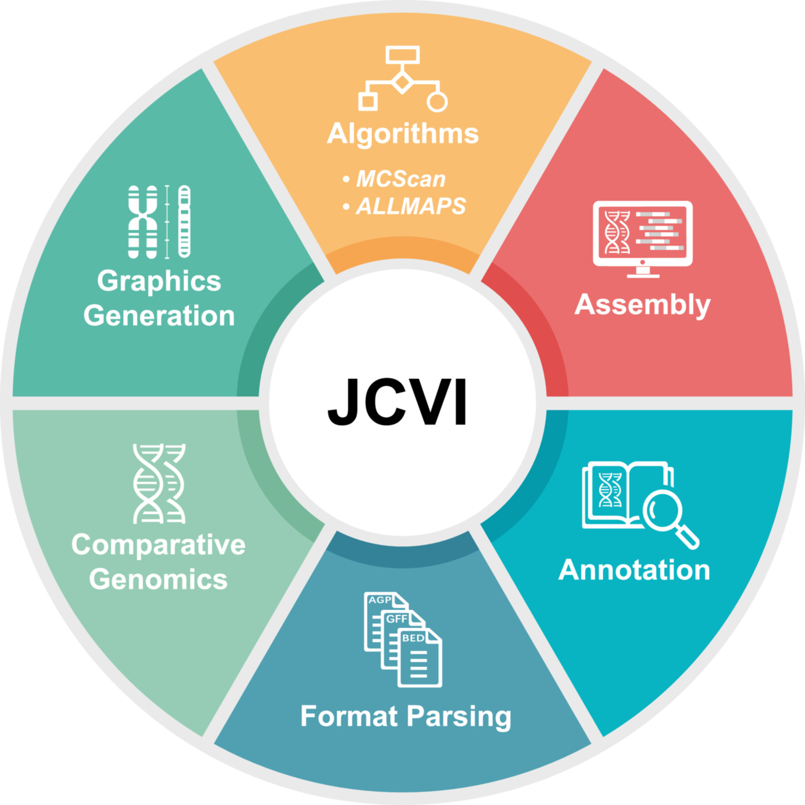
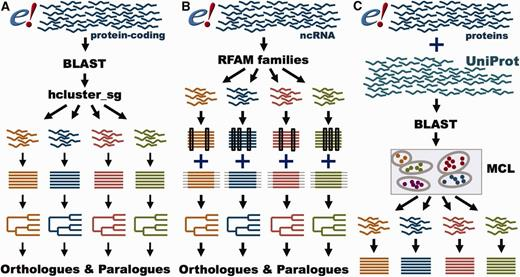
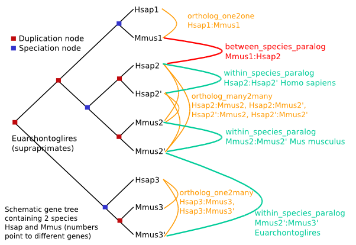
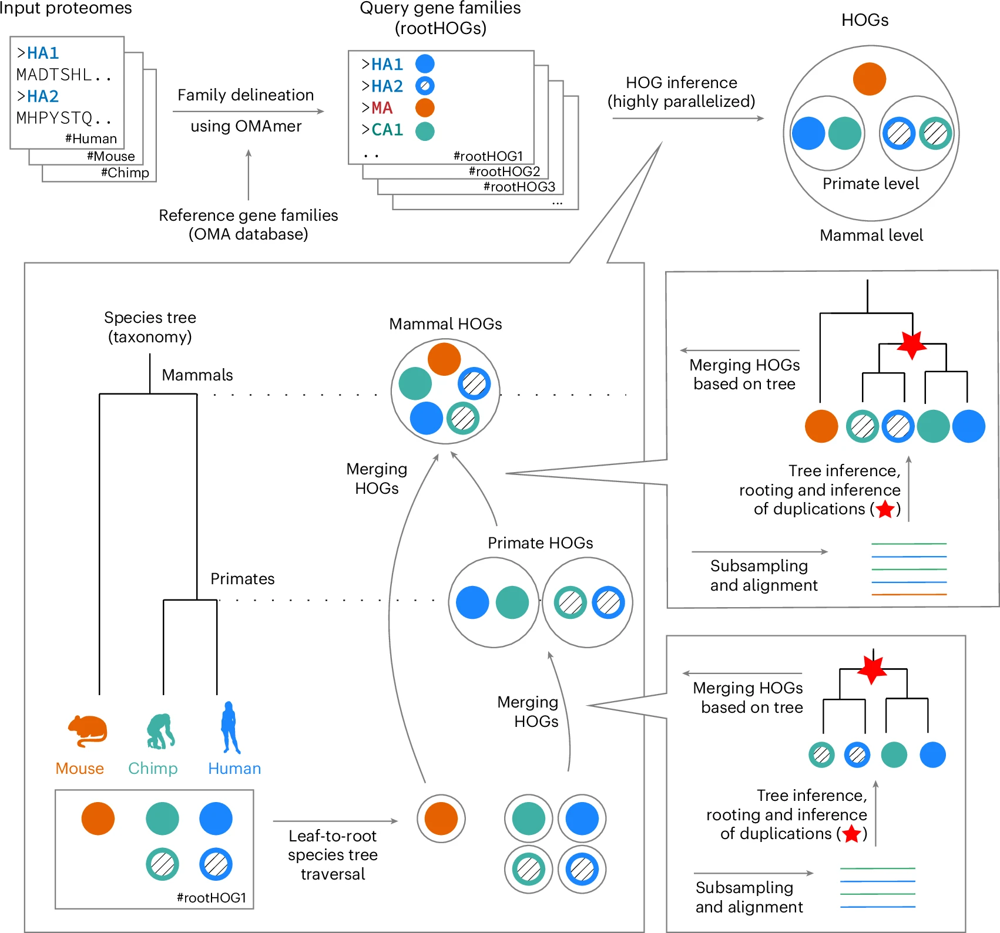
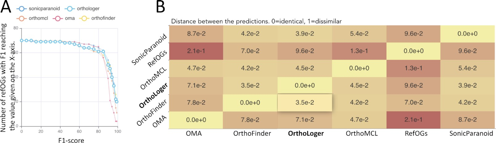
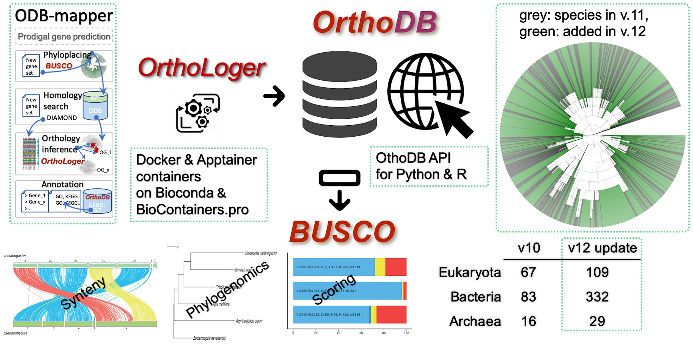
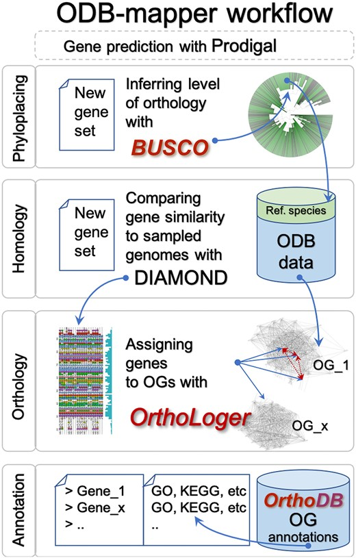
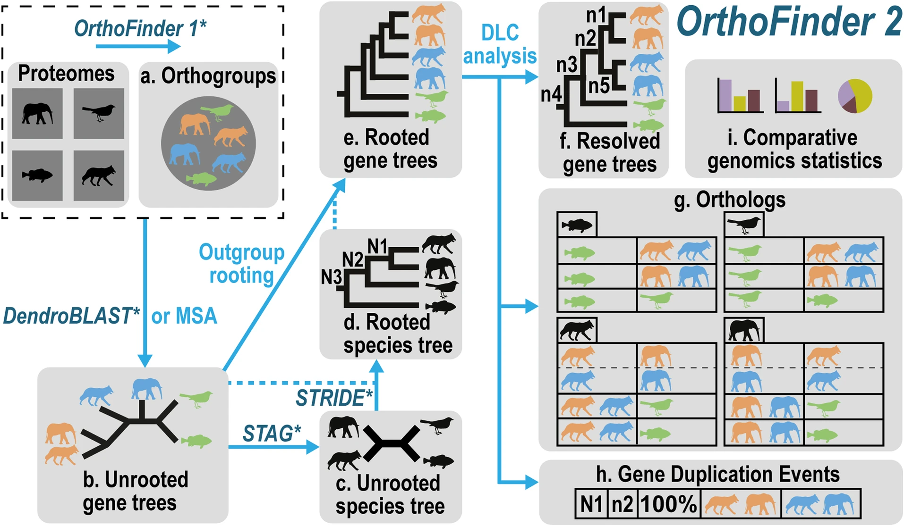
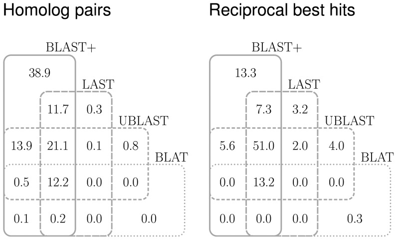

# sources

## software

* [JCVI](https://github.com/tanghaibao/jcvi)
```
pip install git+https://github.com/tanghaibao/jcvi.git
conda install -c conda-forge numpy scipy matplotlib pandas networkx
conda install -c bioconda diamond samtools
conda install -c conda-forge imagemagick
conda install -c conda-forge tectonic
jcvi --version
```
* [FastOMA](https://github.com/DessimozLab/FastOMA)
* [OrthoFinder](https://github.com/davidemms/OrthoFinder)
```
conda install orthofinder -c bioconda
```
* [OrthoHMM](https://github.com/JLSteenwyk/orthohmm)


## DBs

* [GDR](https://www.rosaceae.org/)
* [UniTato](https://unitato.nib.si/)
* [Spud DB](https://spuddb.uga.edu/)
* [Sol Genomics Network](https://solgenomics.sgn.cornell.edu/)
* [Grapedia](https://grapedia.org/files-download/)
* [Phytozome](https://phytozome-next.jgi.doe.gov/)
* [Ensembl Compara](https://ftp.ebi.ac.uk/ensemblgenomes/pub/plants/release-60/tsv/ensembl-compara/homologies/)
* [PLAZA](https://bioinformatics.psb.ugent.be/plaza/versions/plaza_v5_dicots/download/download)
* [OrthoDB](https://www.orthodb.org/)

## genomes, proteomes and General Feature Format files

Reference genomes/proteomes in **bold**

* _Arabidopsis thaliana_: thale cress (ath)
  - [**ARAPORT11**](https://bioinformatics.psb.ugent.be/plaza.dev/_dev_instances/feedback/download/download) primary/selected transcripts
  - [TAIR10](https://phytozome-next.jgi.doe.gov/)
  - [C24](https://www.orthodb.org/)
* _Malus domestica_: apple (mdo)
  - [**Golden delicious GDDH13 v1.1**](https://bioinformatics.psb.ugent.be/plaza.dev/_dev_instances/feedback/download/download) primary/selected transcripts
  - [Honeycrisp Genome v1.1.a1, haplotype 1](https://www.rosaceae.org/species/malus/malus_x_domestica)
* _Prunus amygdalus_, _Prunus dulcis_: almond (pdul)
  - [**Texas v3.0, F1**](https://www.rosaceae.org/organism/24336)
* _Prunus armeniaca_: apricot (parm)
  - [**Marouch n14 v1.0**](https://www.rosaceae.org/organism/24338)
* _Prunus avium_: wild cherry (pavi)
  - [**Tieton v2.0**](https://www.rosaceae.org/organism/24337)
* _Prunus cerasifera_: cherry plum (pcer)
  - [**Montmorency' v1.0.a2**](https://www.rosaceae.org/organism/24337)
* _Prunus persica_: peach (ppe)
  - [**Lovell v2.0.a1**](https://bioinformatics.psb.ugent.be/plaza.dev/_dev_instances/feedback/download/download) primary/selected transcripts
* _Prunus sibirica_: sibearian apricot (psib)
  - [**F106 v1.0**](https://www.rosaceae.org/organism/26133)
* _Pyrus communis_: pear (pcox)
  - [**d'Anjou v2.3.a1, hap 1**](https://www.rosaceae.org/organism/24590)
  - [Pyrus ussuriensis x Pyrus communis](https://www.orthodb.org/)
* _Solanum lycopersicum_: tomato (sly)
  - [**Heinz 1706 ITAG 4.0**](https://bioinformatics.psb.ugent.be/plaza.dev/_dev_instances/feedback/download/download) primary/selected transcripts 
  - [ITAG 5.0](https://phytozome-next.jgi.doe.gov/)
  - [ITAG 3.0](https://solgenomics.net/ftp/genomes/Solanum_lycopersicum/annotation/)
* _Solanum tuberosum_: potato (stu)
  - [**UniTato**](https://unitato.nib.si/)
  - [PGSC 4.03](https://bioinformatics.psb.ugent.be/plaza.dev/_dev_instances/feedback/download/download) primary/selected transcripts
  - [PGSC DM v6.1](https://spuddb.uga.edu/dm_v6_1_download.shtml)
* _Vitis vinifera_: grapevine (vvi)
  - [**T2T (v5)**](https://grapedia.org/files-download/)
  - [12Xv2](https://bioinformatics.psb.ugent.be/plaza.dev/_dev_instances/feedback/download/download) primary/selected transcripts
  - [v4](https://grapedia.org/files-download/)
  - [12Xv0](https://grapedia.org/files-download/)
  - [12X](https://grapedia.org/files-download/)
  - [8x](https://grapedia.org/files-download/)

# pipeline


## JCVI

gene synteny and collinearity - between species

Tang et al. (2024) [JCVI: A Versatile Toolkit for Comparative Genomics Analysis](https://onlinelibrary.wiley.com/doi/10.1002/imt2.211). iMeta.

_"Most notable features include the “compara” module for comparative genomics analysis, offering tools for synteny block reconstruction, gene loss cataloging, quota-based synteny alignment, pedigree visualization, and Ks calculations and visualizations, among others. ...JCVI synteny inference is based on adaptive seeds via LAST and adopts rigorous filtering based on C-score and removal of proximal duplicates, thereby circumventing the difficulties with finding hard E-value cutoffs as well as avoiding artifacts from repeats."_

{width=33%}

[MCscan (Python version)](https://github.com/tanghaibao/jcvi/wiki/Mcscan-(python-version))

1. LAST: find & align related regions of sequences (```.last```)
2. filter the LAST output to remove tandem duplications and weak hits (```.last.filtered```)
3. cluster anchors into synteny blocks (```.anchors``` - seed synteny blocks,  high quality; ```.lifted.anchors``` - additional anchors to form the final synteny blocks)

<br>

* create ```.bed```

keeping one isoform per gene (parameter ```--primary_only```) is problematic, since it takes first listed
```
python -m jcvi.formats.gff bed --type=mRNA --key=Name X.gff3.gz -o X.bed;
```
or
```
python -m jcvi.formats.gff bed --type=mRNA --key=ID X.gff3 -o X.bed;
```


  * ```.CDS``` fasta

```
python -m jcvi.formats.fasta format X.cds.fa.gz X.cds
```

* pairwise synteny search
```
python -m jcvi.compara.catalog ortholog plant1 plant2 --no_strip_names
```

* pairwise synteny visualization
```
python -m jcvi.graphics.dotplot plant1.plant2.anchors
python -m jcvi.compara.synteny depth --histogram plant1.plant2.anchors
```
* macrosynteny visualization
```
python -m jcvi.compara.synteny screen --minspan=30 --simple plant1.plant2.anchors plant1.plant2.anchors.new
python -m jcvi.graphics.karyotype seqids layout
```

## Ensembl Compara

[Comparative genomics and proteomics in Ensembl Sep 2006](https://slideplayer.com/slide/7798307/)


Herrero et al. (2016). [Ensembl comparative genomics resources](https://academic.oup.com/database/article/doi/10.1093/database/bav096/2630091). Database.




- _"Ensembl Compara provides cross-species resources and analyses, at both the sequence level and the gene level"_
- _"All Ensembl gene sequences are compared to one another in order to produce gene trees, infer homologues and produce gene families. These processes are different for coding and non-coding genes"_
- for X and Y species download both, X and Y tables to obtain genegene pairs

[Comparative Genomics](https://mart.ensembl.org/info/genome/compara/index.html)

[Ensembl Compara Schema Documentation](https://mart.ensembl.org/info/docs/api/compara/compara_schema.html)

- protein trees
  - Ensembl canonical translation of each gene from species in Ensembl
  - ```HMM search``` on the ```TreeFam HMM library``` - classify the sequences into their families
  
  - Cluster the genes that did not have any match into additional families
      -  ```NCBI Blast+``` (v2.2.28, parametrs: ```-seg no``` ```-max_hsps_per_subject 1``` ```-use_sw_tback```) on every orphaned gene against every other (both self and non-self species)
      - sparse graph of gene relations based on Blast e-values, generate clusters using ```hcluster_sg``` (```-C``` outgroup: Saccharomyces cerevisiae, arguments: ```-m 750``` ```-w 0``` ```-s 0.34``` ```-O```)
      - iteratively:
          - Do not merge cluster A and B if the total number of edges between A and B is smaller than |A|*|B|/3, where |A| and |B| are the sizes of A and B, respectively. This rule guarantees each cluster is compact
          - Do not join A to any other cluster if |A| < 500. This rule avoids huge clusters which may cause computational burden for multiple alignment and tree building as well
          - Do not join A and B if both A and B contain plant genes or both A and B contain Fungi genes. This rule tries to find animal gene families. ```TreeFam``` clustering is done with outgroups
  -  Large families are broken down with ```QuickTree```, limit set to ```1,500``` genes
  
  -  For each cluster (family), protein MSA ```M-Coffee``` (v9.03.r1318, ```afftgins_msa```, ```muscle_msa```, ```kalign_msa```, t```_coffee_msa```) or ```Mafft``` (large clusters, v7.113, ```--auto```)
  
  -  For each aligned cluster, phylogenetic tree ```TreeBeST``` using the CDS back-translation of the protein multiple alignment from the original DNA sequences. A rooted tree with internal duplication tags is obtained at this stage, reconciling it against a species tree inferred from the NCBI taxonomy
     +  build five different trees:
        * a maximum likelihood (```ML```) tree built, based on the protein alignment with the WAG model, which takes into the account the species tree (modified version of phyml release 2.4.5)
        * a ML tree built using ```phyml```, based on the codon alignment with the Hasegawa-Kishino-Yano (```HKY```) model, also taking into account the species tree (modified version of phyml release 2.4.5)
        * a neighbour-joining (```NJ```) tree using ```p```-distance, based on the codon alignment
        * a ```NJ``` tree using ```dN``` distance, based on the codon alignment
        * a ```NJ``` tree using ```dS``` distance, based on the codon alignment
    + the final tree is made by merging the five trees into one consensus tree using the "```tree merging```" algorithm
    + branch lengths are estimated for the final consensus tree based on the DNA alignment, using ```phyml``` with the ```HKY``` model

  -  From each gene tree, infer gene pairwise relations of orthology and paralogy types
  -  A stable ID is assigned to each ```GeneTree```


<br>

* Homology types



  + Orthologues
     * 1-to-1 orthologues (ortholog_one2one)
     * 1-to-many orthologues (ortholog_one2many)
     * many-to-many orthologues (ortholog_many2many)
     * between-species paralogues – only as exception
  + Homoeologues
  + Paralogues
      * same-species paralogies (within_species_paralog)
      * fragments of the same ‐predicted‐ gene (gene_split)
  + Confidence scores
     * duplication confidence score for each duplication node (```Jaccard index```)
  + Between species paralogues
     * duplication weakly-supported, ```duplication confidence``` score ≤ ```0.25```
  + Gene splits
     * pairs pairs of genes that lie close to each other (< ```1 MB```)
  + Confidence scoring
  

* Orthology quality-controls
  + Gene order conservation (GOC) score
     * how many of the four closest neighbours of a gene match between orthologous pairs
  + Whole genome alignment score
     * pairwise whole genome alignments (WGA)
     * coverage of the alignment over the orthologue pair
  + High-confidence orthologies
     * Min. ```GOC``` score: 50
     * Min. ```WGA``` score: 50
     * Min. ```%identity```: 25


## PLAZA


Van Bel et al. (2022) [PLAZA 5.0: extending the scope and power of comparative and functional genomics in plants](https://academic.oup.com/nar/article/50/D1/D1468/6423187). Nucleic Acids Res.


[construction](https://bioinformatics.psb.ugent.be/plaza/documentation/construction)

* Gene family evolution
  - Protein clustering
     + homologous gene families construction applying sequence based protein clustering: ```DIAMOND``` combined with ```Tribe-MCL``` (homologous families) & ```OrthoFinder``` (sub-families) This way the quality of the protein clustering can be inspected and can subgroups be detected.
  - Multiple Alignments
     + ```MAFFT```
  - Tree Inference
     + contruction: ```FastTree```
     + ```Notung 2.6``` - root the trees and to infer speciation and duplication events using the tree reconciliation mode and applying the Duplication/Loss Score to evaluate alternate hypotheses
     +  tree visualization: ```PhyD3```


* Genome evolution
  - Colinearity within and between species: ```i-ADHoRe``` - detects genomic homology based on the identification of conservation of gene content and gene order
  - Ks-based dating: ```PAML``` - date colinear gene pairs based on aligned coding sequences (```CLUSTALW```)
  - Ks values are used to color multiplicons in the WGDotplot based on their age and a distribution, is shown to discriminate multiple duplications

* Integrative Orthology data
  - _*Tree-based ortholog: TROG*_
  - Orthologous gene family: ORTHO
  - Colinearity: anchor_point
  - Best-Hits-and-Inparalogs: BHIF


## FastOMA

between species

Majidian et al. (2025) [Orthology inference at scale with FastOMA](https://www.nature.com/articles/s41592-024-02552-8). Nat Methods.

- _" First, we leverage our current knowledge of the sequence universe (with its evolutionary information stored in the OMA database) to efficiently place new sequences into coarse-grained families (hierarchical orthologous groups (HOGs) at the root level) using the alignment-free ```k-mer```-based ```OMAmer``` tool."_

- _"In an attempt to detect homology among unplaced sequences (which could belong to families that are absent from our reference database), we then perform a round of clustering using the highly scalable ```Linclust``` software."_

- _"Next, we resolve the nested structure of the HOGs corresponding to each ancestor, in an efficient leaf-to-root ```traversal``` of the species tree."_

- _"By avoiding sequence comparisons across different families, the number of computations is drastically reduced compared with conventional approaches."_

{width=100%}
<br>

- _"Input proteomes are mapped to reference gene families using the ```OMAmer``` software, forming hierarchical orthologous groups (HOGs) at the root level (rootHOGs)."_

- _"HOGs are inferred using a ‘bottom-up’ approach, starting from the leaves of the species tree and moving towards the root."_

- _"At each taxonomic level, HOGs from the child level are merged, resulting in HOGs at the current level."_

- _"To decide which HOGs should be merged, sequences from the child HOGs are used to create a MSA (```MAFFT```), followed by gene tree inference (```FastTree2```) to identify speciation and duplication events."_

- _"Child HOGs are merged if their genes evolved through speciation."_


[omabrowser module fastOMA](https://omabrowser.org/oma/academy/module/fastOMA)

Input:

* [omamer database](https://omabrowser.org/oma/current/)
  - LUCA.h5
  - Metazoa.h5
  - *_Viridiplantae.h5_*
  - Saccharomyceta.h5
  - Primates.h5
  - Homininae.h5
* rooted Species tree in ```newick``` format, branch lengths not needed
* protein sequences in FASTA format (with ```.fa``` extension) in the folder ```proteome```

Parameters:

* [nextflow.config](https://github.com/DessimozLab/FastOMA/blob/main/nextflow.config)

Steps

* Step 1: FastOMA gene family inference
  - mapping the input proteomes onto the reference HOGs using the ```OMAmer``` tool
  - proteins mapped to the same reference HOG are grouped together, forming query rootHOGs, with the exclusion of proteins already present in the database
  - find query rootHOGs that are associated with the same gene family -> score: ```-ln (P value)``` of having as many or more k-mers in common between the protein sequence and the HOG under a binomial distribution -> default threshold = ```70``` -> graph of rootHOGs -> add an edge between rootHOGs when a minimum of ```10``` proteins (default) are mapped to both query rootHOGs and it represents at least either ```80%``` of all proteins mapping to the bigger rootHOG or ```90%``` of those mapping to the smallest one
  - proteins not assigned to any reference HOGs - singleton ->  ```Linclust``` (MMseqs package) -> new query rootHOGs

* Step 2: FastOMA orthology inference
  - identify the genes that are grouped together at each taxonomic level as a HOG (descended from a single gene at that specific level); number of HOGs at each level reflects the number of copies of the gene present in the ancestral species
  - bottom-up approach by traversing the species tree
  - Gene tree inference
    - MSA ```MAFFT```
    - column-wise trimming; default threshold ```0.2```
    - ```FastTree```
    - subsampling, ```20``` proteins
  - Duplication and speciation event labeling
    -  internal node: duplication or a speciation event
    - ratio == ```0``` -> speciation event
    - default species overlap ratio < ```0.1``` -> very low support for a duplication event
  - HOG merging
    - speciation event -> merging of the HOGs
    - duplication event -> split the subHOG
  - Inferring orthology relationship
    - orthology and paralogy relationships


```my_custom.config```

```
params {
  write_msas = true
  report = true
  write_genetrees = true
  force_pairwise_ortholog_generation = true
  filter_method = 'col-elbow-row-threshold'
  filter_gap_ratio_row = 0.3
  filter_gap_ratio_col = 0.3
  nr_repr_per_hog = 12
  min_sequence_length = 40
}

```

```
# in ./oma_path/
wget https://omabrowser.org/All/OmaServer.h5
wget https://omabrowser.org/All/speciestree.nwk

# NCBITaxonId | ParentTaxonId | Name
# 1437201 | 91827 | Pentapetalae

omamer mkdb --db Pentapetalae.h5 --oma_path ./oma_path/ --root_taxon "Pentapetalae" --nthreads 28 --log_level info

```

```

nextflow run ../FastOMA.nf -profile standard \
  --input_folder ./input \
  --output_folder output \
  --omamer_db ./input/Viridiplantae.h5 \
  --max_cpus 64 \
  --fasta_header_id_transformer noop \
  --with-report \
  -c ./input/my_custom.config | tee run4.log
  
  
nextflow run ../FastOMA/FastOMA.nf -profile standard \
  --input_folder ./input \
  --output_folder output \
  --omamer_db ./input/Pentapetalae.h5 \
  --max_cpus 24 \
  --fasta_header_id_transformer noop \
  --with-report \
  -c ./input/my_custom.config | tee run4_Pentapetalae.log

```


## OrthoDB

Kuznetsov et al. (2023). [OrthoDB v11: annotation of orthologs in the widest sampling of organismal diversity](https://academic.oup.com/nar/article/51/D1/D445/6814468). Nucleic Acids Research.

_"In OrthoDB, we rely on the ```OrthoLoger``` software that is configured to use ```MMseqs2``` for homology searches, relies on best-reciprocal-hits between each pair of species for identification of candidate orthologs (as best-reciprocal-hit is a proxy for reconciliation of the gene tree and a pair of species), and clusters these candidates into OGs."_



Tegenfeldt et al. (2025). [OrthoDB and BUSCO update: annotation of orthologs with wider sampling of genomes](https://academic.oup.com/nar/article/53/D1/D516/7899526). Nucleic Acids Research.

_"Evolutionary histories of multigene families of homologs can be complex, and striving for more specificity generally results in more over-splitting of OGs. In contrast, approaches like ```OrthoMCL``` and ```OrthoFinder``` favor inclusivity, increasing sensitivity but reducing specificity, leading to results that encompass broader families of homologs. OrthoDB (https://www.orthodb.org) is balancing sensitivity and specificity to optimize accuracy of functional inferences."_



_"OrthoLoger offers ab initio ortholog prediction and a hierarchical mode guided by a user-provided species tree/taxonomy that improves scalability and consistency across different levels of orthology. This hierarchical mode was used for the OrthoDB v12 update."_




* [```OrthoLoger```](https://orthologer.ezlab.org/) for delineation of orthologs
  - ```ODB-mapper``` - map fasta file(s) to OrthoDB orthologs
  - ```orthologer``` - find orthologs in a set of fasta files
  - homology: ```diamond``` or ```mmseqs```
  - low-complexity masking: ```segmasker``` from NCBI Blast
  - similarity: ```cd-hit```
  - clustering: ```BRHCLUS```


- ortho pairs: ```eudicotyledons```


## OrthoFinder

Emms, D.M., Kelly, S. (2019). [OrthoFinder: phylogenetic orthology inference for comparative genomics](https://genomebiology.biomedcentral.com/articles/10.1186/s13059-019-1832-y). Genome Biol.



_"(a) orthogroup inference, (b) inference of gene trees for each orthogroup, (c and d) analysis of these gene trees to infer the rooted species tree, (e) rooting of the gene trees using the rooted species tree, and (f–h) duplication-loss-coalescence (DLC) analysis of the rooted gene trees to identify orthologs and gene duplication events (mapped to their locations in both the species and gene trees). "_


[Methods](https://github.com/davidemms/OrthoFinder?tab=readme-ov-file#methods)


* Standard workflow
  - ```DIAMOND``` or ```MMseqs2``` (recommended, although ```BLAST+``` can be used instead)
  - ```MCL``` graph clustering algorithm
  - ```FastME```

* MSA workflow
  - Multiple sequence alignment program: ```MAFFT``` (recommended), ```Muscle```
  - Tree inference program: ```FastTree``` (recommended), ```IQTREE˙``` (takes a very large amount of time to run on a reasonable sized dataset), ```raxml```


### within genomes

```
#!/bin/bash

# Number of threads to use
THREADS=28

# File containing input/output directory pairs
PAIR_FILE="dir_pairs.txt"

# Log file with timestamp
LOGFILE="orthofinder_$(date '+%Y%m%d_%H%M%S').log"

# Function to print timestamped messages to screen and log
log_msg() {
  local msg="$1"
  echo "[$(date '+%Y-%m-%d %H:%M:%S')] $msg" | tee -a "$LOGFILE"
}

log_msg "Starting OrthoFinder runs"

while read -r input_dir output_dir; do
  log_msg "Running OrthoFinder for input: $input_dir, output: $output_dir"
  
  # Run orthofinder, capture both stdout and stderr, tee to log
  orthofinder -f "$input_dir" \
              -M msa \
              -S diamond_ultra_sens \
              -T iqtree \
              -t "$THREADS" \
              -n orthofinder \
              -o "$output_dir" 2>&1 | tee -a "$LOGFILE"
  
  # Check exit status
  if [ ${PIPESTATUS[0]} -ne 0 ]; then
    log_msg "OrthoFinder failed for $input_dir"
  else
    log_msg "OrthoFinder completed for $input_dir"
  fi

done < "$PAIR_FILE"

log_msg "All OrthoFinder runs completed"


```


### between taxa


## RBH

reciprologs



https://doi.org/10.1371/journal.pone.0101850


[BLAST+ reciprocal best hit (RBH) search in R](https://drostlab.github.io/orthologr/reference/blast_rec.html)

[blast for rbh in Python](https://widdowquinn.github.io/2018-03-06-ibioic/02-sequence_databases/05-blast_for_rbh.html)

[arxiv: Reciprocal best hits are not a logically sufficient condition for orthology](https://arxiv.org/pdf/0706.0117)


# Filter

```

Initialize an empty set or list covered_genes.

For each method in the list: ["MCScanX", "ensembl-compara", "PLAZA", "OrthoDB", "RBH", "FastOMA"] OR ["MCScanX", "ensembl-compara", "PLAZA", "OrthoDB", "FastOMA", "RBH"]

For every row in the data table dt:

a. Check if criteria is "reject" for the row.

b. Check if the value of the column corresponding to method in this row is TRUE.

c. Check if from_geneID in this row are not in covered_genes.

d. If method is one of ["OrthoDB", "RBH", "FastOMA"] OR ["OrthoDB", "FastOMA", "RBH"]:

  Check if gene pair is covered by all three methods:
  If yes:
  is_candidate = TRUE
  new_criteria = "OrthoDB_FastOMA_RBH"
  
  Else if gene pair is covered by any two of those three methods:
  If yes:
  is_candidate = TRUE
  new_criteria = join the two method names with underscore, e.g. "OrthoDB_FastOMA" or "RBH_FastOMA" or "OrthoDB_RBH"
  
  Else if MapMan4_Match string contains "match based on" and current method name:
  is_candidate = TRUE
  new_criteria = {method}_MapMan4 (e.g., "RBH_MapMan4")
  
  Else:
  is_candidate = FALSE

e. If all applicable conditions above are met, mark this row as a candidate for assignment.


After evaluating all rows for the current method:

a. If there are any candidate rows:

i. Assign the criteria of those candidate rows to the current method.

ii. Add all unique to_geneID and from_geneID values from those candidate rows to the covered_genes set to prevent reassignment.

Repeat for next method until all methods are processed.

```
